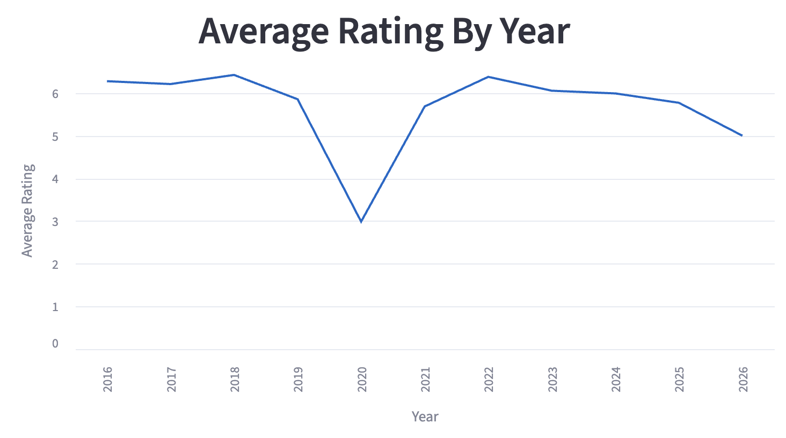
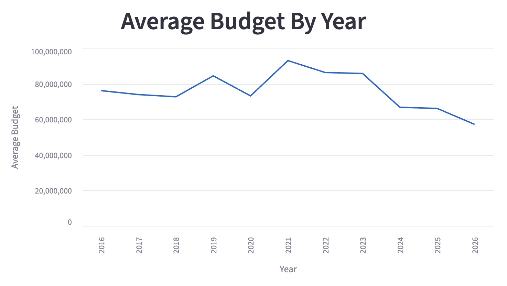
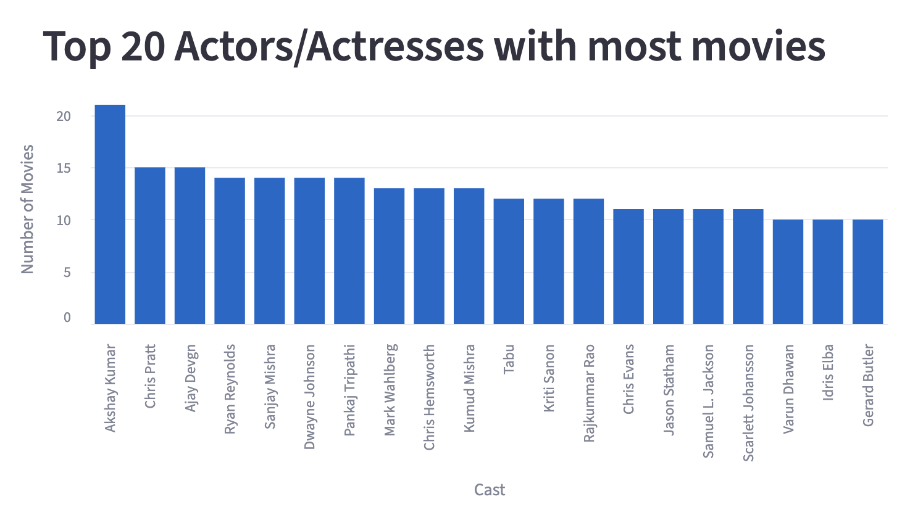
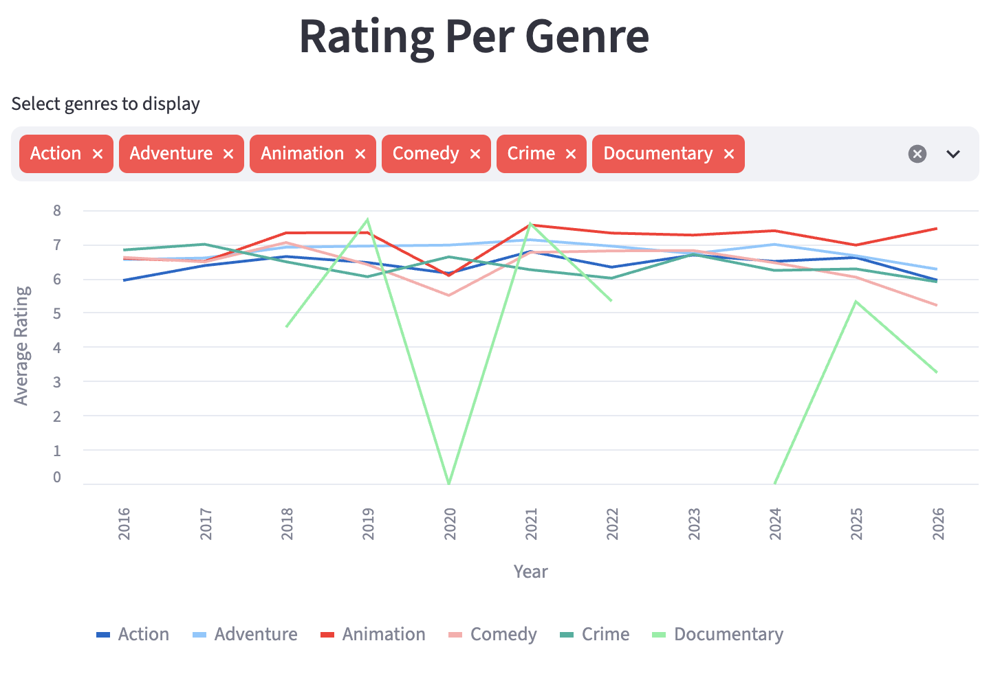
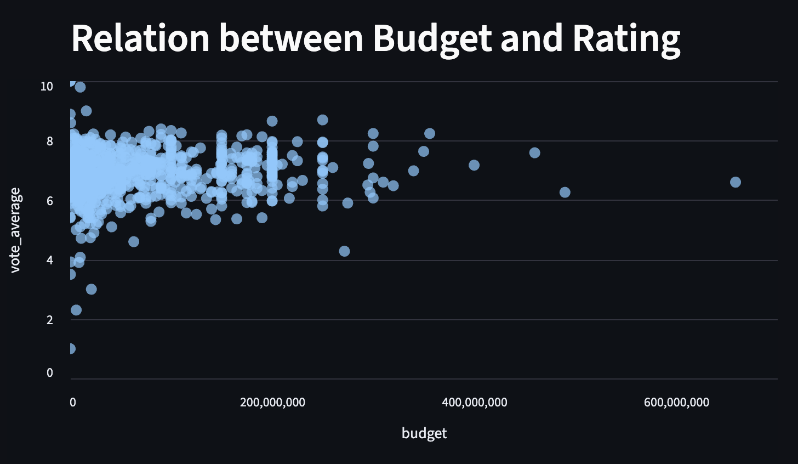

# Triwood Movies Pipeline

> A production-grade ETL pipeline extracting multi-language movie data from TMDB, transforming it into a star schema, and serving analytics via Streamlit.

[](https://python.org)
[](https://postgresql.org)
[](https://streamlit.io)
[](https://airflow.apache.org)

**Author:** Matina Tuladhar  
**Role:** Aspiring Data Engineer  
**Dataset:** ~3,000+ production records across English, Hindi, and Korean (2016-2026)

---
## Demo (Please Watch at 1080p for best experience.)

[Watch the video demo](https://m.youtube.com/watch?v=b9H8565tJbA&pp=0gcJCcQLAYcqIYzv)

---

## What It Does

1. **Extracts** raw movie data from the TMDB API across three languages
2. **Filters & enriches** — keeps top genres and cast, adds detailed metadata
3. **Transforms** into a proper **star schema** with dimensions, facts, and bridge tables
4. **Loads** into PostgreSQL with full PK/FK constraint enforcement
5. **Serves** interactive analytics via Streamlit

---

## Architecture

```
TMDB API
    |
    v
+-----------------+     +-----------------+     +-----------------+
|  ingest_raw_    |---->|  filter_movies  |---->| ingest_details  |
|    data.py      |     |    .py          |     |    .py          |
+-----------------+     +-----------------+     +-----------------+
                                                         |
                    +------------------------------------+
                    v
           +-----------------+
           |   transform.py  |  <- Star Schema Builder
           |   (Pandas)      |
           +-----------------+
                    |
                    v
           +-----------------+
           |    load.py      |  <- Full Load (truncate + append)
           |  (SQLAlchemy)   |
           +-----------------+
                    |
           +-----------------+
           | load_incremental|  <- Incremental Load (filter + append)
           |    .py          |
           +-----------------+
                    |
                    v
           +-----------------+
           |  PostgreSQL 16  |  <- Docker
           |  (Star Schema)  |
           +-----------------+
                    |
                    v
           +-----------------+
           | src/dashboard/  |  <- Streamlit
           |    app.py       |
           +-----------------+
```

---

## Star Schema Design

| Table | Type | Key Columns | Constraints |
|-------|------|-------------|-------------|
| `dim_movies` | Dimension | `movie_id` PK, `movie_title`, `original_language` | `PRIMARY KEY` |
| `dim_genres` | Dimension | `genre_id` PK, `genre_name` | `PRIMARY KEY`, `UNIQUE` |
| `dim_cast` | Dimension | `cast_id` PK, `cast_name` | `PRIMARY KEY`, `UNIQUE` |
| `fact_movies` | Fact | `movie_id` PK/FK, `release_date`, `popularity`, `revenue`, `budget`, `vote_average`, `vote_count`, `runtime` | `PRIMARY KEY`, `FOREIGN KEY -> dim_movies`, `ON DELETE CASCADE` |
| `bridge_genres` | Bridge | `movie_id`, `genre_id` | Composite `PRIMARY KEY`, dual `FOREIGN KEY`s |
| `bridge_cast` | Bridge | `movie_id`, `cast_id`, `cast_order` | Composite `PRIMARY KEY`, dual `FOREIGN KEY`s |

**Why star schema?** It eliminates data duplication in many-to-many relationships (movies <-> genres, movies <-> cast) while keeping analytical queries fast and intuitive.

---

## Tech Stack

| Layer | Tool | Purpose |
|-------|------|---------|
| Language | Python 3.10+ | ETL logic |
| Data Processing | Pandas | Transformation & type coercion |
| Database | PostgreSQL 16 | Data warehouse |
| ORM/Connector | SQLAlchemy + psycopg2 | Schema-aware loading |
| Orchestration | Apache Airflow | DAG-based scheduling |
| Visualization | Streamlit | Interactive dashboard |
| Infrastructure | Docker Compose | Local Postgres container |
| Quality | Custom `quality.py` | Runtime data validation |

---

## Project Structure

```
Triwood-Movies-Pipeline/
├── src/
│   ├── dashboard/
│   │   └── app.py                  # Streamlit analytics app
│   └── pipeline/
│       ├── ingest_raw_data.py      # Bronze: fetch from TMDB API
│       ├── filter_movies.py        # Silver: filter by date range
│       ├── ingest_details.py       # Silver: enrich with details (genre/cast)
│       ├── transform.py            # Gold: build star schema DataFrames
│       ├── load.py                 # Gold: full load with quality gates
│       ├── load_incremental.py     # Gold: incremental load (new records only)
│       ├── quality.py              # DataQualityError + validation rules
│       └── logger_config.py        # Centralized logging
├── data/
│   ├── bronze/                     # Raw JSON dumps
│   └── silver/                     # Cleaned + enriched JSON
├── docs/
│   └── screenshots/                # Dashboard screenshots for README
├── migrations/
│   ├── 20260805000001_create_dim_movies.sql
│   ├── 20260805000002_create_dim_genres.sql
│   ├── 20260806000003_create_dim_cast.sql
│   ├── 20260806000004_create_fact_movies.sql
│   ├── 20260806000005_create_bridge_genres.sql
│   └── 20260806000006_create_bridge_cast.sql
├── dags/
│   └── triwood_pipeline.py         # Airflow DAG with BranchPythonOperator
├── docker-compose.yml              # Postgres 16 container
├── .env.example                    # Template for secrets
├── .gitignore
└── README.md
```

---

## Quick Start

### Prerequisites
- Python 3.10+ with `uv` (or `pip`)
- Docker & Docker Compose
- TMDB API key ([get one free](https://www.themoviedb.org/settings/api))

### 1. Clone & Configure
```bash
git clone https://github.com/matinatula/Triwood-Movies-Pipeline.git
cd "Triwood Movies Pipeline"
cp .env.example .env
# Edit .env and add your TMDB_API_KEY
```

### 2. Start PostgreSQL
```bash
docker-compose up -d
```

### 3. Run Migrations
```bash
for f in migrations/*.sql; do
  docker exec -i triwood-movies-pipeline \
    psql -U postgres -d triwood_movies_pipeline < "$f"
done
```

### 4. Run the Pipeline (Full Load)
```bash
uv run python src/pipeline/load.py
```

Expected output:
```
Loaded ~3000 rows into 'dim_movies' table.
Loaded 19 rows into 'dim_genres' table.
Loaded ~5000 rows into 'dim_cast' table.
Loaded ~6000 rows into 'bridge_genres' table.
Loaded ~13000 rows into 'bridge_cast' table.
Loaded ~3000 rows into 'fact_movies' table.
```

### 5. Run Incremental Load
```bash
uv run python src/pipeline/load_incremental.py
```

Expected output:
```
Found 3000+ existing movies in database.
No new movies to load. Database is already up to date.
```

### 6. Launch the Dashboard
```bash
uv run streamlit run src/dashboard/app.py
```
Open [http://localhost:8501](http://localhost:8501)

---

## Data Quality

Every pipeline run enforces three gates in `load.py` via `quality.py`:

| Check | Rule | Failure Action |
|-------|------|----------------|
| `check_no_duplicate_movie_ids` | `dim_movies.movie_id` must be unique | Raises `DataQualityError` |
| `check_budget_non_negative` | `fact_movies.budget >= 0` | Raises `DataQualityError` |
| `check_vote_average_range` | `fact_movies.vote_average` between 0 and 10 | Raises `DataQualityError` |

Additionally, `transform.py` handles TMDB's sentinel values:
- `revenue=0`, `budget=0`, `runtime=0` -> converted to `pd.NA` (not real zeros)
- `release_date` -> cast to `datetime64[ns]` for proper time-series analysis

---

## Dashboard Insights

> Screenshots from the Streamlit analytics dashboard.

### 1. Average Rating by Year


**Insight:** A dramatic drop in 2020 (~3.0 avg) reflects the COVID-19 impact on film production quality, followed by a 2022 recovery and gradual decline as market saturation increases.

### 2. Average Budget by Year


**Insight:** Post-COVID pent-up demand drove a 2021 budget peak (~$95M), but studios have since reduced spending (~$57M by 2026) amid streaming economics and risk aversion.

### 3. Top 20 Actors by Movie Count


**Insight:** Akshay Kumar leads with ~21 films, revealing a key cultural pattern - Bollywood actors typically maintain higher output volume than Hollywood counterparts in our tri-language dataset.

### 4. Rating Per Genre (Multi-line)


**Insight:** Genre stability varies dramatically. Documentary ratings swing from 0 (2020) to 8+ (2024), while mainstream genres like Animation and Adventure remain more resilient to external shocks.

### 5. Budget vs. Rating Scatter


**Insight:** No strong correlation between budget and quality. Low-budget films frequently achieve ratings comparable to $400M+ blockbusters - the cluster proves money doesn't guarantee audience satisfaction.

---

## Key Design Decisions

| Decision | Rationale |
|----------|-----------|
| **Migration-first schema** | Tables are created via versioned SQL files with full PK/FK constraints. `to_sql` only appends data - schema and data are decoupled. |
| **Star schema over flat table** | Handles many-to-many relationships (movies <-> genres, movies <-> cast) without denormalization bloat. |
| **Bridge tables with composite PKs** | Enforces referential integrity at the database level, not just in Pandas. |
| **Truncate-and-load pattern** | Tables are truncated before append, making the pipeline idempotent for reliable re-runs. |
| **Incremental loader** | Queries existing IDs and appends only new records, demonstrating production-scale loading without re-processing the entire dataset. |
| **BIGINT for revenue/budget** | Prevents `NumericValueOutOfRange` on blockbuster films (e.g., Avatar-level revenues). |
| **Int64 (nullable) over int64** | Pandas nullable integers hold `pd.NA` for TMDB's unknown-value sentinels, preventing skewed averages. |

---

## Data Scale

| Layer | Volume |
|-------|--------|
| Raw API calls (bronze) | ~6,000 movies fetched across 3 languages |
| After filtering (silver) | ~2,900 movies (date-filtered) |
| After deduplication (gold) | ~3,000+ movies in star schema (accumulated across runs) |
| Unique genres | 19 |
| Unique cast members | 4,124 |
| Genre relationships | 3,360 bridge rows |
| Cast relationships | 7,044 bridge rows |
| Time range | 2016–2026 (10 years) |

**Why this size matters:** Large enough to show real trends (COVID dip, genre volatility, budget patterns), small enough to run entirely on a laptop without Spark or cloud infrastructure. Warehouse queries and dashboard loads run in under 5 seconds. The full API extraction takes longer due to rate-limiting delays.
---

## License

MIT

---

<p align="center">Built with curiosity by <strong>Matina Tuladhar</strong></p>
